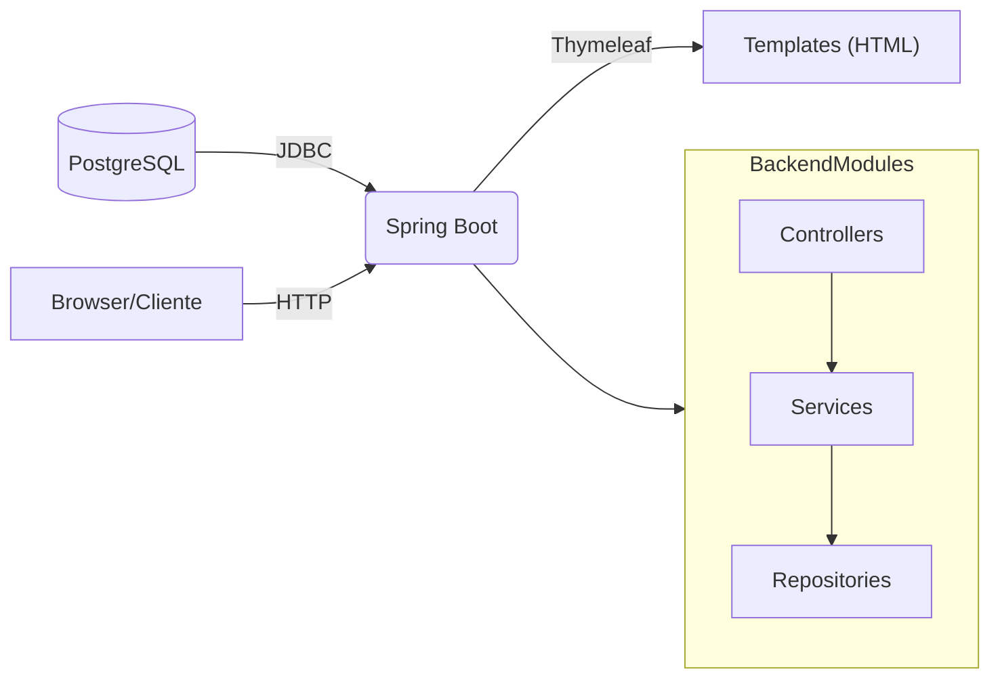

# 👽 Voyager People Management

Uma aplicação simples em Spring Boot para gerenciar cargos, departamentos, funcionários, pontos e relatórios.

## 🔥 Autores / Créditos

- Faculdade: Engenheiro Slavador Arena
- Disciplina: Linguagens de Programação II
- Henrico Birochi — RA: 081230027
- Vítor Agostino Braghittoni — RA: 081230024

## 😅 Requisitos

- ✔️ Java 21 (conforme `pom.xml`)
- ✔️ Maven (use o wrapper incluído `./mvnw`)
- ✔️ Docker (opcional, recomendado para rodar PostgreSQL localmente)

## 🐳 Como rodar (local com Docker)

1. (Opcional) Inicie o PostgreSQL com Docker Compose. O arquivo `docker-compose.yml` já configura um banco `voyager` com usuário `voyager` / senha `voyager`:

```bash
docker-compose up -d
```

2. Rode a aplicação usando o wrapper do Maven:

```bash
./mvnw spring-boot:run
```

Por padrão a aplicação tenta usar as seguintes variáveis de ambiente (se não estiverem definidas, ajuste o `application.properties` ou forneça variáveis):

- ✔️ JDBC_DATABASE_URL=jdbc:postgresql://localhost:5432/voyager
- ✔️ JDBC_DATABASE_USERNAME=voyager
- ✔️ JDBC_DATABASE_PASSWORD=voyager

### 😭 Rodando sem Docker

Se preferir usar um PostgreSQL já existente, defina as variáveis de ambiente acima apontando para seu banco e em seguida rode:

```bash
./mvnw spring-boot:run
```

## 👀 Observações

- Em desenvolvimento o projeto usa `spring.jpa.hibernate.ddl-auto=update` para facilitar a evolução do esquema. Em produção, prefira usar migrações (Flyway/Liquibase) e uma política de DDL mais segura.
- As views Thymeleaf estão em `src/main/resources/templates` e os recursos estáticos em `src/main/resources/static`.

## 📈 Diagrama (Mermaid)

Um diagrama simples que mostra os principais componentes e fluxo de dados. Você pode colar este bloco em https://mermaid.live para visualizar.



## 📌 Build e testes

Para executar testes (usa H2 em testes) e gerar o JAR:

```bash
./mvnw clean package
```

Para empacotar sem executar testes rápidos:

```bash
./mvnw -DskipTests package
```

## 📃 Sobre

Projeto desenvolvido para a disciplina "Linguagens de Programação II".

## 👋 Contato

Abra uma issue neste repositório para reportar bugs ou pedir melhorias. Os autores acima podem ser contatados pelos RAs listados.
